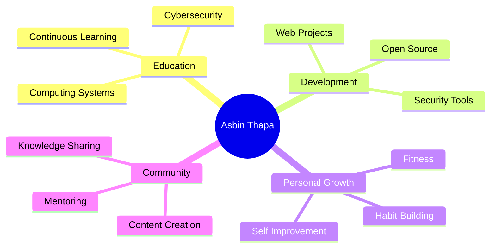

<div align="center">


# 👋 Hi, I'm Asbin Thapa


[](https://asbinthapa.info.np/)
[](mailto:asbinthapa27@gmail.com)
[]()


</div>

---

## 🌟 About Me

```javascript
const asbinThapa = {
    location: "London, UK 🇬🇧 (from Nepal 🇳🇵)",
    education: "Computing Systems @ University",
    role: "Cyber Security Expert & Full Stack Developer",
    
    expertise: {
        webDevelopment: ["HTML", "CSS", "JavaScript", "Python"],
        security: ["Cybersecurity", "Digital Safety", "System Integrity"],
        marketing: ["Digital Marketing", "Content Creation", "SEO"],
        design: ["UI/UX", "Responsive Design", "User Experience"]
    },
    
    currentFocus: [
        "🔒 Building cybersecurity awareness projects",
        "🌐 Developing web applications",
        "💪 Personal growth and fitness",
        "📚 Continuous learning and self-improvement"
    ],
    
    passions: [
        "Making technology accessible",
        "Sharing knowledge",
        "Digital security awareness",
        "Self-transformation"
    ],
    
    funFacts: [
        "⚽ Football enthusiast",
        "💻 Always experimenting with new tech",
        "🎯 Focused on habit improvement",
        "🌱 Believer in personal growth"
    ]
};
```

> **SEO Keywords:** Asbin Thapa, Asbin thapa info, asbin thapa london, asbin chetrri, Computing Systems student, web developer, cybersecurity, digital marketing, content creator, tech projects, GitHub portfolio

---

## 🎓 Education & Background

<table>
<tr>
<td width="50%">

### 🎯 Current
- 📚 **Computing Systems** Student
- 🌍 Based in **London, UK**
- 🇳🇵 Originally from **Nepal**
- 🔐 Specializing in **Cybersecurity**

</td>
<td width="50%">

### 💡 Interests
- 🔒 **Digital Security & Privacy**
- 🌐 **Web Technologies**
- 📊 **Digital Marketing & SEO**
- 🎨 **UI/UX Design**

</td>
</tr>
</table>

---

## 🛠️ Technical Skills

<div align="center">

### Languages & Technologies


### Frameworks & Tools


### Specializations


</div>

---

## 📂 Featured Projects

<div align="center">

### 🌐 Personal Portfolio & Web App
[](https://asbinthapa.info.np/)

**Interactive personal portfolio showcasing projects and skills**
- 🎨 Modern, responsive design
- ⚡ Fast performance & optimized
- 📱 Mobile-first approach
- 🔧 Built with: HTML, CSS, JavaScript

---

### 🌾 Januka Agriculture & Animal Farm
[](https://janukaagricultureandanimalfarm.com.np/)

**Professional business website for agricultural services**
- 📊 Digital marketing integration
- 🎯 SEO optimized
- 📞 Contact & service showcase
- 🔧 Built with: HTML, CSS, JavaScript, SCSS

---

### 🔒 Cybersecurity Awareness Projects
[]()

**Educational content and tools for digital safety**
- 📚 Security awareness campaigns
- 🎓 Educational resources
- 🔐 Best practices guides
- 🌐 Online safety tools

</div>

---

## 📊 GitHub Statistics

<div align="center">


</div>

<div align="center">


</div>

---

## 🏆 GitHub Achievements

<div align="center">


</div>

---

## 💼 Professional Experience

<table>
<tr>
<td width="50%">

### 🔒 Cybersecurity
- Security awareness campaigns
- Digital safety education
- System integrity focus
- Vulnerability assessment
- Best practices implementation

</td>
<td width="50%">

### 🌐 Web Development
- Full-stack web applications
- Responsive design
- SEO optimization
- Performance tuning
- User experience focus

</td>
</tr>
<tr>
<td width="50%">

### 📊 Digital Marketing
- Content strategy
- SEO & SEM
- Social media marketing
- Brand awareness
- Campaign management

</td>
<td width="50%">

### 🎨 Content Creation
- Technical writing
- Video content
- Educational materials
- Social media content
- Community engagement

</td>
</tr>
</table>

---

## 🎯 Current Focus



---

## 🌐 Connect With Me

<div align="center">

### 📱 Social Media

[](https://asbinthapa.info.np)
[](mailto:asbinthapa27@gmail.com)
[](https://www.linkedin.com/in/asbin-thapa-6a9a4733b/)
[](https://www.instagram.com/asbin_chetrri/)
[](https://x.com/MeHope55586)

### 📚 Academic & Professional

[](https://scholar.google.com/citations?hl=en&user=z0WH1LoAAAAJ)
[](https://orcid.org/0009-0002-6807-1932)
[](https://github.com/asbinthapa99)

</div>

---

## 📈 Contribution Activity

<div align="center">


</div>

---

## ⚡ Fun Facts About Me

<table align="center">
<tr>
<td align="center" width="25%">

### ⚽
**Football Player**
Love playing and watching football

</td>
<td align="center" width="25%">

### 💻
**Tech Explorer**
Always learning new technologies

</td>
<td align="center" width="25%">

### 💪
**Fitness Enthusiast**
Health and wellness advocate

</td>
<td align="center" width="25%">

### 🎯
**Goal Setter**
Focused on personal growth

</td>
</tr>
</table>

---

## 🎓 Learning Journey

```python
class AsbinThapa:
    def __init__(self):
        self.name = "Asbin Thapa"
        self.role = "Computing Systems Student"
        self.location = "London, UK"
        self.languages = ["Python", "JavaScript", "SQL", "HTML", "CSS"]
        
    def current_focus(self):
        return [
            "Advancing cybersecurity skills",
            "Building web applications",
            "Digital marketing mastery",
            "Personal development",
            "Community contribution"
        ]
    
    def life_motto(self):
        return "Continuous learning, constant growth 🚀"

me = AsbinThapa()
print(me.life_motto())
```

---

## 📫 Get In Touch

<div align="center">

### 💬 Let's Collaborate!

I'm always interested in:
- 🤝 Collaboration on interesting projects
- 💼 Freelance opportunities
- 🎓 Knowledge sharing and mentoring
- 🔒 Cybersecurity discussions
- 🌐 Web development projects

**Feel free to reach out!**

[](mailto:asbinthapa27@gmail.com)

</div>

---

## 🌟 Support My Work

<div align="center">

If you find my projects helpful or inspiring:

[](https://github.com/asbinthapa99?tab=repositories)
[](https://github.com/asbinthapa99)

</div>

---

## 📊 Visitor Stats

<div align="center">


**Thank you for visiting my profile! 🙏**


</div>

---

<div align="center">

### 💝 Quote of the Day


---

**Made with ❤️ by Asbin Thapa**

*Last Updated: September 2025*


</div>

<!-- Google Site Verification -->
<meta name="google-site-verification" content="D6t6VD3Zt7wBQcaY" />

---

⭐ **From [asbinthapa99](https://github.com/asbinthapa99)** - *Transforming ideas into digital reality*
